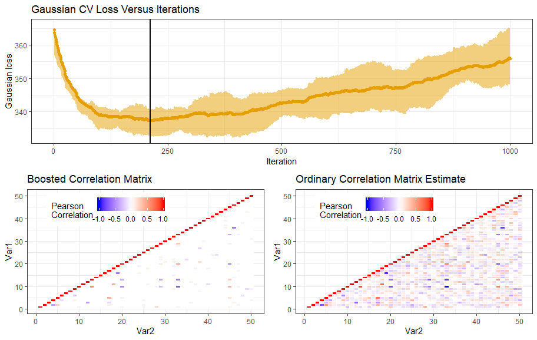

<!-- badges: start -->
[](https://travis-ci.org/Blunde1/covboost)
[](https://www.tidyverse.org/lifecycle/#experimental)
[-blue)](https://www.gnu.org/licenses/gpl-3.0.html)
---------


# covboost
Estimate (possibly sparse, high dimensional) covariance matrix through boosting

`covboost` boosts out the path of the correlation matrix starting from the Identity matrix and eventual convergence (if enough iterations are used) at the ordinary [covariance matrix estimate](https://en.wikipedia.org/wiki/Estimation_of_covariance_matrices#Estimation_in_a_general_context).

## Installation

Install the development version from GitHub
```r
devtools::install_github("Blunde1/covboost")
```
The package is hopefully soon on CRAN.

## Example code and documentation

There are two main functions
- `covboost_cv`: Boosts out the covariance matrix using k-fold cross validation.
- `covboost`: Boosts out the covariance matrix.

Both functions above runs in parallel (OpenMP), and returns useful information and plots from cross validation and the best (in terms of Gaussian loss) covariance matrix. See the example below.

```r
library(covboost)

# -- Generate some Gaussian data with a few (random) non-zero correlations --
p <- 100
n <- 50
x <- matrix(nrow=n, ncol=p)
x[,1] <- rnorm(n)
for(j in 2:p){
    rho <- runif(1,-1,1)*rbinom(1,1,0.5)
    col_dependence <- sample(j-1,1)
    x[,j] <- rnorm(n, mean=rho*x[,col_dependence], sd=(1-rho^2))
}

# -- Run `covboost_cv` to find the best iteration and check convergence --
lrn_rate <- 0.2
cov_cv <- covboost_cv(x, learning_rate=lrn_rate)

# -- Plot to check convergence --
cov_cv$cvplot 
cov_cv$opt_iter

# -- Run `covboost` with the best iteration --
sigma <- covboost(x, niter=cov_cv$opt_iter, learning_rate=lrn_rate)
sigma$cov
sigma$plot # plot (sparse) covariance matrix
```
The code above generates the convergence plot (top), and images of the obtained (sparse) boosted covariance matrix. For reference, here is the ordinary (dense) covariance matrix estimate (bottom right). Note a few significant non-zero correlations in the boosted covariance estimate (bottom left).

